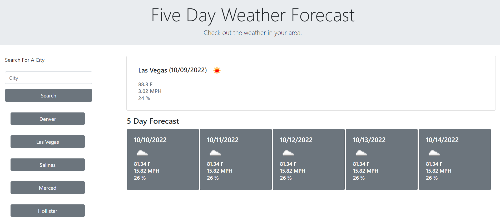

# 5-day-forecast

## Description

This project allows a user to input a city's name and recieve a 5 day weather forecast. Upon first landing on the page, it may not look like much, but the javascript file simply awaits an input from the user. The javascript file takes the input to display the date,  temperature, wind speed, and humidity. Another function I added was to create a button with the user's input, so they may quickly display the forecast again. This function saves data to the local storage so them may leave the page and the last 5 searches will still be avaliable. 

Here is a screenshot of a city's weather:



This is the function I used to create a button based off the users input. I pass the function a string that is equal to the city that they searched and it creates a new button on the page. 

```javascript
function createBtnList(city) {

    var temp = $("<button>", { "class": "cityBtn btn btn-secondary m-3 col-8" })
    temp.attr("data-city", city);
    temp.text(city);
    $(".btnList").append(temp);

}
```
The code snippet below is how I checked if the button was already listed on the page. At first I tried using jQuery to search the page but I could not properly utilize the data I was given back. Instead I compared the "new" input to the local storage and if it was in the LS I would simply return. Inside the else statement I check if the array length is equal to 5 since that was the maximum buttons I wanted on the page. Before editing the html I needed to get the LS in order or the logic would fall apart. I spliced the first element in the array and then pushed the new input on. After all that I then sent the new input to create a new button. 

```javascript
 if (cityArray.includes(city)) {
        return;
    }
    else {
        // check if cityArray is equal to 5, thats the max I want displayed
        if (cityArray.length == 5) {
            // splice the first
            cityArray.splice(0, 1);
            // push the new city
            cityArray.push(city);
            // delete first btn
            $("body > div.row.w-100 > div.col-3 > div > button:nth-child(1)").remove();
            createBtnList(city);
        }
        else if (cityArray.length < 5) {
            createBtnList(city);
            cityArray.push(city);
        }
        //save new array to LS
        localStorage.setItem("Cities", JSON.stringify(cityArray));

```

## Installation

No installation required. Simply go to github page.

Here is the link to see how I built the webpage with HTML, CSS, and javasript.

[Github Repo](https://github.com/johnfrom209/5-day-forecast)

[Deployed Page](https://johnfrom209.github.io/5-day-forecast/)

## Usage

Once you land on the page, locate the input field. Enter a valid city name and the javascript file takes that input and searches with an api for coordinates. Those coordinates, latitude and longitude, grabs the data of the location and returns that to the javascript. The javascript file saves the temp, wind speed, and humidity. I then paired that data up with moment to display the date those data properties belong to. I fill the main display using jquery to find the selector id's. The forecast days are dynamically created and appended to the div. If you want another location simply input another city name into the input field or click on one of the quick search buttons. 

## Credits

Uses JQuery, moment, and bootstrap.

## Contact Me

[Linkedin](https://www.linkedin.com/in/johnfrom209/)

[View my Github Repo](https://github.com/johnfrom209)

## License

Refer to the license in the Github repo.
